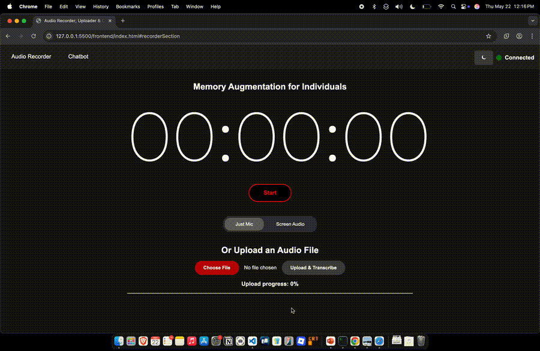
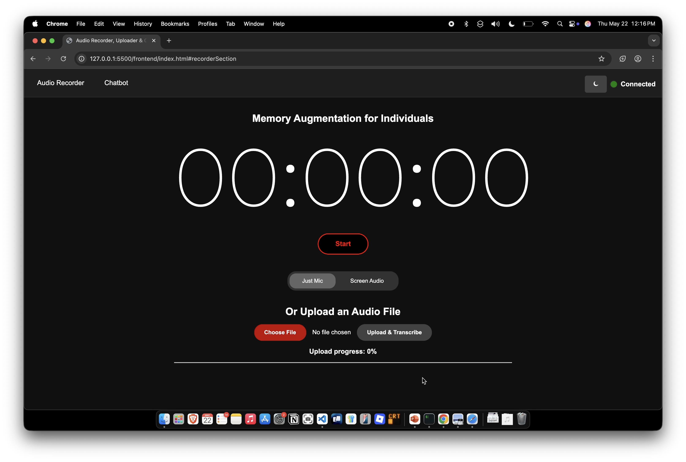
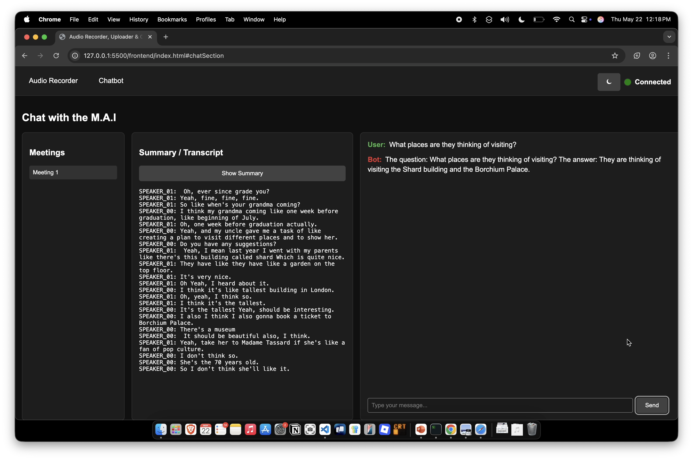
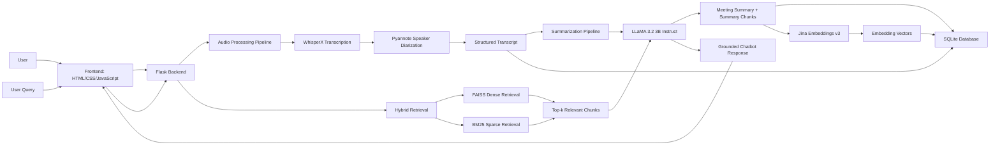
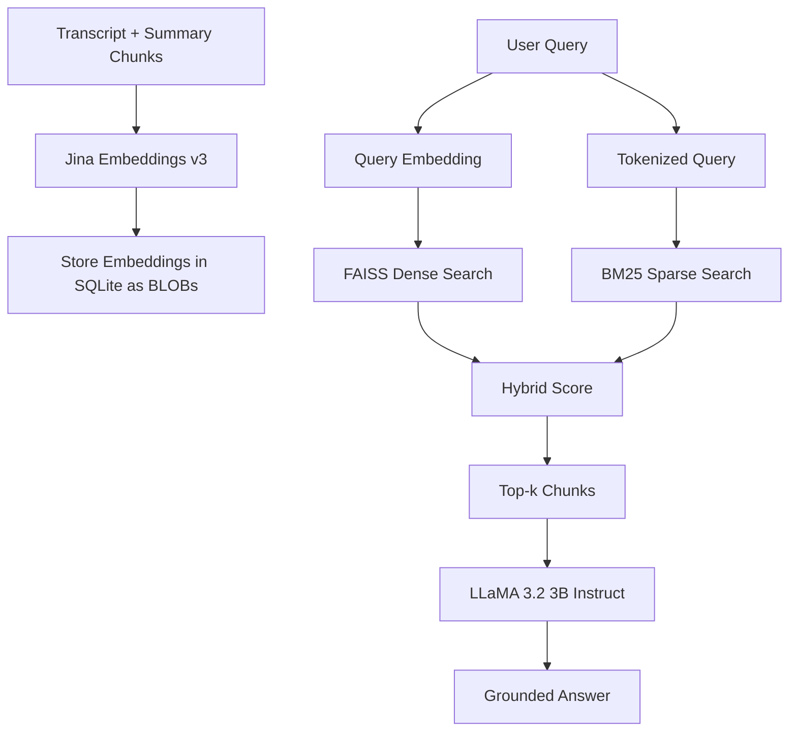

# Memory Augmentation for Individuals

A local-first AI meeting memory system that helps users record, transcribe, diarize, summarize, store, and query conversations.

This project was developed as a final-year Computer Science dissertation project. It combines automatic speech recognition, speaker diarization, large language models, vector search, keyword retrieval, and a web-based user interface to help users recall important details from meetings and conversations.

---

## Overview

Traditional notes and voice recordings are useful, but they do not provide intelligent recall. This project turns raw meeting audio into structured, searchable memory.

The system allows users to:

* Record live microphone audio.
* Record screen/system audio and microphone audio for online meetings.
* Upload pre-recorded audio files.
* Transcribe meetings using WhisperX.
* Identify speakers using speaker diarization.
* Generate structured meeting summaries.
* Store transcripts, summaries, embeddings, and chat history in SQLite.
* Ask questions about a selected meeting using a RAG chatbot.
* Retrieve relevant meeting chunks using hybrid FAISS + BM25 retrieval.
* Use a locally hosted open-weight LLM for summarization and question answering.

During development, a custom fine-tuned model was initially explored for summarization and question answering. However, after testing its output quality and considering the available compute resources, the final system was redesigned to use an open-weight instruction-tuned model instead. This improved response quality, reduced development complexity, and made the NLP pipeline more reliable for both meeting summarization and RAG-based question answering.

---

## Demo



---

## Screenshots

### Recording and upload interface



### Meeting transcript, summary, and chatbot interface



---

## System Architecture

The project is split into four main layers:

1. Frontend interface
2. Audio processing pipeline
3. NLP summarization pipeline
4. Retrieval-Augmented Generation chatbot pipeline



---

## Key Features

### Audio Recording and Upload

The frontend supports two recording modes:

* Microphone recording for in-person conversations.
* Screen audio + microphone recording for online meetings.

It also supports audio file uploads, allowing users to process pre-recorded meetings.

### Speech Recognition and Diarization

The backend uses WhisperX for transcription and Pyannote-based diarization. This produces a structured transcript where each segment is associated with a speaker label.

Example output:

```text
SPEAKER_00: We should review the project timeline next week.
SPEAKER_01: Agreed. I will prepare the updated milestones.
```

### Two-Stage Summarization

Long meeting transcripts often exceed the context window of a language model. To handle this, the system uses a two-stage summarization pipeline:

1. Split the transcript into overlapping chunks.
2. Summarize each chunk individually.
3. Merge the chunk summaries.
4. Summarize again to produce a final meeting-level summary.

This helps reduce noise and makes the data more useful for retrieval.

### Retrieval-Augmented Generation Chatbot

The chatbot answers questions about a selected meeting using retrieved transcript/summary chunks.

The retrieval system combines:

* FAISS for dense semantic retrieval.
* BM25 for keyword-based lexical retrieval.
* Jina Embeddings v3 for text embeddings.
* SQLite for persistent storage of meetings, summaries, embeddings, and chat history.

This hybrid approach helps the system retrieve both semantically relevant content and exact keyword matches.

### Persistent Meeting Memory

The system stores:

* Meeting transcripts
* Generated summaries
* Transcript/summary chunks
* Vector embeddings
* Chat history

This allows users to return to previous meetings and continue asking questions about them.

## Model Selection

The NLP pipeline originally explored fine-tuning a smaller transformer-based model for meeting summarization and question answering. However, the fine-tuned model did not provide a strong enough improvement for the project’s use case, especially when compared with modern open-weight instruction-tuned models.

The final implementation therefore uses **LLaMA 3.2 3B Instruct** as the main language model. This model was selected because it provides a better balance between output quality, instruction-following ability, and local hardware requirements. It is used for both summarization and chatbot response generation, meaning the model only needs to be loaded once during execution.

To make local inference more practical, the model is loaded using quantization, reducing memory usage while still keeping the output quality suitable for the application.


---

## Tech Stack

| Layer         | Technology                                          |
| ------------- | --------------------------------------------------- |
| Frontend      | HTML, CSS, JavaScript                               |
| Backend       | Flask, Flask-CORS                                   |
| Transcription | WhisperX                                            |
| Diarization   | Pyannote Audio                                      |
| LLM           | LLaMA 3.2 3B Instruct                               |
| Quantization  | BitsAndBytes 8-bit loading                          |
| Embeddings    | Jina Embeddings v3                                  |
| Vector Search | FAISS                                               |
| Sparse Search | BM25                                                |
| Database      | SQLite                                              |
| NLP Utilities | Hugging Face Transformers, LangChain text splitters |
| Language      | Python                                              |

---

## Repository Structure

```text
memory-augmentation-rag/
│
├── frontend/
│   ├── index.html
│   ├── script.js
│   └── styles.css
│
├── database/
│   └── db_manager.py
│
├── server.py
├── summariser.py
├── rag_pipeline.py
├── rag_model.py
├── requirements.txt
└── README.md
```

---

## API Endpoints

| Endpoint                         | Method | Purpose                                    |
| -------------------------------- | ------ | ------------------------------------------ |
| `/ping`                          | GET    | Check backend connection                   |
| `/transcribe`                    | POST   | Upload audio and generate transcript       |
| `/chat`                          | POST   | Ask a question about a selected meeting    |
| `/get_meeting_ids`               | GET    | Fetch stored meeting IDs                   |
| `/get_meeting/<meeting_id>`      | GET    | Fetch transcript and summary for a meeting |
| `/get_chat_history/<meeting_id>` | GET    | Fetch previous chat history                |

---

## RAG Pipeline

The retrieval pipeline works as follows:



The final retrieval score combines dense semantic similarity and sparse keyword relevance.

---

## Evaluation

A small-scale human evaluation was conducted with 5 participants. Participants tested the system using meeting-style audio and interacted with the transcript, summary, and chatbot features.

Key observations:

* Users found the transcripts and summaries helpful.
* The chatbot worked best when questions were specific.
* Some vague queries produced weaker answers.
* Feedback on the UI was mixed, with some users preferring a more unified layout.
* The evaluation highlighted future improvements around query rewriting, robustness, and UI refinement.

---

## Limitations

* The current system is optimized for desktop use.
* Chatbot response quality depends on the specificity of the user query.
* Very long meetings may require further optimization.
* Diarization quality can vary depending on audio quality and speaker overlap.
* A full quantitative RAG evaluation was not completed in the initial version.

---

## Future Work

Planned improvements:

* Add query rewriting for vague user questions.
* Add RAGAS-based evaluation for context precision, recall, and faithfulness.
* Improve mobile responsiveness.
* Add multi-hop question answering across multiple meeting chunks.
* Add meeting deletion and export features.
* Improve packaging and setup with Docker.
* Add a cleaner UI for viewing summaries, transcripts, and chatbot history.
* Support fully offline deployment on consumer hardware.

---

## Project Motivation

The goal of this project is to reduce cognitive load during meetings by allowing users to focus on the conversation rather than manual note-taking. By converting conversations into searchable memory, the system can support productivity, meeting review, and assistive memory use cases.

---

## Disclaimer

This project is a research prototype. It is not intended for use with sensitive or confidential recordings without proper consent, privacy safeguards, and secure deployment practices.
